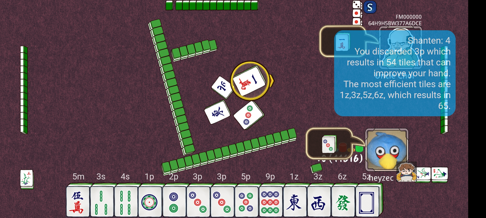

# AutoVision（麻将训练器）

[](https://github.com/shidaxinyyds/001/actions/workflows/build.yml)

AutoVision（麻将训练器）旨在提升你在 [Let's Mahjong](https://play.google.com/store/apps/details?id=com.gdapp.mjlafree&hl=en&gl=US) 中的对局体验，通过实时分析，给出每一手“打哪张牌更优”的策略建议。


_截图：在 Let's Mahjong 对局过程中显示的分析建议_

它的灵感来自 [Euophrys 的麻将效率训练器](https://euophrys.itch.io/mahjong-efficiency-trainer)。

## 功能

- **优化对局决策：** 评估每一张舍牌的策略价值（进张数 / ukeire），帮助你在麻将对局中做出更优的弃牌选择。
- **机器学习技术：** 尝试并实现了多种机器学习方法来定位、检测并分类屏幕上的麻将牌。

## 使用的技术

- **Flutter：** 用于构建 App 的用户界面，包括显示分析建议的悬浮窗层。
- **Python（通过 [Chaquopy](https://chaquo.com/chaquopy/)）：** 每一帧屏幕画面的处理（检测、识别麻将牌）都在设备本地用 Python 完成。
- **OpenCV：** 用于在屏幕上检测和分类麻将牌。

在麻将中，一手牌通常由 13 张组成（轮到你舍牌时为 14 张），牌的种类共 34 种。

为了定位所有牌，程序使用 OpenCV 的 `findContours` 函数寻找轮廓。对全部轮廓的中心点做概率 [霍夫直线变换](https://docs.opencv.org/3.4/d9/db0/tutorial_hough_lines.html)，可以检测出排成一条直线（很可能是玩家手牌）的轮廓。

为了对每张牌进行分类，作者最初尝试了 [SIFT](https://www.wikipedia.com/en/Scale-invariant_feature_transform)（尺度不变特征变换）检测器。但由于不同牌之间（尤其同花色内）存在大量重复图案，分类经常出错。最终采用了**模板匹配**：为 34 种牌分别手动截取游戏内牌面作为模板。

未来希望能探索少样本学习（few-shot learning）和孪生神经网络（Siamese network）。

## 麻将术语表

| 术语 | 说明 |
|---|---|
| [向听数（Ukeire / 进张）](https://riichi.wiki/Ukeire) | 也称“进张数”，指当前手牌还能接收多少张牌来改善牌型（即降低向听数）。本应用正是以此训练用户。（数值越大越好） |
| [向听（Shanten）](https://riichi.wiki/Shanten) | 距离听牌还差几张。任何导致向听数增加的舍牌都会被本应用标出。（数值越小越好） |
| [听牌（Tenpai）](https://riichi.wiki/Tenpai) | 手牌已就绪，即只差一张牌即可和牌 |
| MPSZ 记法 | 描述牌面的简写，例如 `4788m12446s34p26z`。详见此 Reddit 帖子：[链接](https://www.reddit.com/r/Mahjong/comments/dgth5z/is_there_a_standard_notation_for_tiles/) |

> 应用内界面已自动将 MPSZ 记法转换为中文牌名，例如 `4788m12446s34p26z` 会显示为“4万7万8万8万1万2万4万4万6万3筒4筒2字6字”。

## 使用说明

1. 在 Google Play 商店安装 Let's Mahjong App：[链接](https://play.google.com/store/apps/details?id=com.gdapp.mjlafree&hl=en&gl=US)
1. 安装本应用“AutoVision 麻将训练器”（APK 由 GitHub Actions 自动构建，请从工作流运行的 Artifacts 下载）。
1. 打开“麻将训练器”，点击“授权通知”以允许显示通知。这是因为 Android 要求前台服务必须显示一条常驻通知（前台服务用于录制屏幕）。
1. 先确保手机处于横屏模式，再点击“开始识别”，并授予屏幕录制权限。
1. 打开 Let's Mahjong 开始任意一局麻将。快速开始的方法：点击 开始 → 自由对战（Freeplay）进行离线对局。
1. 正常进行对局。每次轮到你舍牌时，屏幕右上角都会出现分析建议。

### 悬浮按钮与悬浮窗

开启识别后，屏幕右上角会出现一个**橙色圆形悬浮按钮（可拖动）**，这就是“悬浮窗按钮”：

- 识别尚未出结果时，按钮内显示转圈加载；一旦识别到牌局，按钮内变为眼睛图标。
- **点击该悬浮按钮**会展开为“分析悬浮窗”，显示当前手牌、向听数以及针对你上一手舍牌的中文点评。
- 在悬浮窗内点击“收起”可缩回为悬浮按钮；点击“停止”会结束识别并关闭悬浮窗。

## 编译说明

1. 确保已具备以下构建环境（使用 [Nix 包管理器](https://www.wikipedia.com/en/Nix_(package_manager)) 的用户可直接运行 `nix develop` 一键安装）：
   - Flutter SDK（3.13.x，与 CI 同版本）
   - Android SDK
   - Python 3
1. 下载 Flutter 依赖：
   ```
   dart pub get
   ```
1. 编译 APK：
   ```
   flutter build apk --release   # 发布包（默认用 debug 签名，可直接安装）
   flutter build apk --debug     # 调试包
   ```
   生成的 APK 位于 `build/app/outputs/flutter-apk/` 目录下。

> 说明：由于本应用通过 Chaquopy 在 Android 内运行 Python，首次构建时 Gradle 会自动下载 OpenCV（约 4.5.1）、Pillow、mahjong 等 Python 包，耗时较长，请耐心等待；请确保网络可访问 Chaquopy 的 PyPI 镜像。

## 已知限制

- 牌面识别依赖针对 Let's Mahjong 内置牌面裁剪的模板，对其他麻将 App 或不同主题的牌面可能识别不准。
- 屏幕录制与悬浮窗权限由系统弹窗申请，弹窗文案跟随系统语言，无法通过本应用修改。
- 本应用仅用于练习与分析，不影响游戏本身的逻辑与结果。
