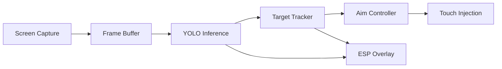

# AimBuddy

AimBuddy is an AI-based Android aim assistant for real-time screen capture, object detection, target tracking, visual guidance overlays, and optional assisted input.

## Project in Brief

- **Platform**: Android (arm64-v8a)
- **App stack**: Kotlin + Jetpack Compose + native C++ (JNI)
- **Inference**: NCNN runtime with Vulkan GPU acceleration (YOLOv26n)
- **Training**: Python pipeline with Ultralytics, PyTorch, and NCNN export

## Runtime Modes

| Mode | Backend | Requires | Features |
|------|---------|----------|----------|
| Visual Assist | none | - | Screen capture, YOLO inference, target tracking, ESP overlays |
| Assisted Input (root) | `uinput` virtual touchscreen | Root access | ESP + low-latency touch injection that runs **in parallel with the user's finger** (separate input stream, real touchscreen is never grabbed) |
| Assisted Input (non-root) | Shizuku `injectInputEvent` | Shizuku service + permission | Same parallel-touch behavior with no root, using a virtual deviceId so the aim contact dispatches alongside physical touches |

If neither backend is available, the app stays in Visual Assist Mode and the menu still loads.

### Feature Highlights

- **Simultaneous user + aim touch** on both backends so you can move and aim at the same time.
- **Streamer mode** - toggle in the ESP tab sets `FLAG_SECURE` so the overlay disappears from screen recordings, screenshots, and screen mirroring while staying visible on your own screen.
- **Chinese (中文) UI** language in addition to English. Drop a CJK TTF at `app/src/main/assets/fonts/cjk.ttf` to render glyphs.
- **Event-driven aim loop** - first touch lands within one inference cycle of target acquisition; no polling.
- **Velocity lead prediction** scaled to the measured pipeline delay, so running targets are actually led instead of trailed.
- **Adaptive crop** that shrinks under GPU pressure to keep `< 10ms` inference.

## How It Works



1. **Capture**: MediaProjection captures the game screen at 1280x720.
2. **Detect**: YOLOv26n runs on the GPU via NCNN to detect enemies.
3. **Track**: DeepSORT-style tracker maintains target identity across frames.
4. **Aim**: PD controller steers aim with velocity lead and jitter suppression.
5. **Render**: ESP overlay draws boxes, snap lines, and an ImGui settings menu.

## Device Requirements

### Runtime (Android Device)

| Item | Minimum | Recommended |
|------|---------|-------------|
| Android | 11 (API 30) | 13+ |
| ABI | arm64-v8a | Snapdragon 888+ |
| Graphics | OpenGL ES 3.1 | OpenGL ES 3.2 + Vulkan |
| RAM | 6 GB | 8 GB+ |
| Storage | 2 GB free | 5 GB+ free |
| Root *or* Shizuku | Not required for ESP | Either one enables aim assist |

### Training (Windows PC)

| Item | Minimum | Recommended |
|------|---------|-------------|
| OS | Windows 10 64-bit | Windows 11 64-bit |
| Python | 3.10 to 3.12 | 3.11 |
| CPU | 4 cores | 8+ cores |
| RAM | 8 GB | 16 GB+ |
| Storage | 15 GB free | 30 GB+ free |
| GPU | CPU-only supported | NVIDIA with CUDA 12.1 |

## Quick Start

### 1. Build and Install

```powershell
./gradlew.bat clean assembleDebug
./gradlew.bat installDebug
```

Prerequisites:
- Android SDK 35
- Android NDK 29.0.13113456 rc1
- CMake 3.22.1
- Java 11+

### 2. First Launch

1. Open AimBuddy on your device.
2. Grant overlay permission when prompted.
3. Pick a backend for aim assist (optional):
   - Approve root access for the `uinput` backend, or
   - Install Shizuku, start the service, and grant the Shizuku permission for the non-root backend. See [docs/ShizukuSetup.md](docs/ShizukuSetup.md) for a step-by-step beginner guide.
   - Skip both to run in visual-assist mode (ESP only).
4. Grant MediaProjection screen capture permission.
5. The overlay appears with ESP boxes and a floating settings icon.

### 3. Train Your Own Model (Optional)

```powershell
cd training
scripts\00_automate.bat
```

This single command runs: env setup -> frame extraction -> **teacher auto-labelling** -> negative mining (if you've dropped frames into `raw_frames/negatives/`) -> stable train/valid/test split -> dataset validation -> training at `imgsz=640` with strong augmentations -> NCNN export at `imgsz=256` -> deploy to `app/src/main/assets/models/` -> active-learning sweep that surfaces the next batch of frames worth labelling. State checkpoints at each step so re-running resumes from the last failure.

The only manual touch points are:
1. Drop gameplay video into `training/videos/`.
2. (Optional) Drop no-enemy frames into `training/raw_frames/negatives/`.
3. Spot-check `training/dataset/train/labels/` after the auto-label step and delete obviously-wrong boxes (Roboflow / labelImg take minutes vs the hours of from-scratch labelling).

See the [Training Guide](docs/Training.md) for the per-step scripts and the bigger explanation of why this works.

## Build Details

### Debug Build

```powershell
./gradlew.bat clean assembleDebug
```

### Release Build

```powershell
./gradlew.bat clean assembleRelease
```

### Manual APK Install

```powershell
adb install -r app/build/outputs/apk/debug/app-debug.apk
```

## Training and Export

From the repository root:

```powershell
cd training
scripts\07_run_full_pipeline.bat
```

This runs environment setup, dataset validation, training, and NCNN export.

Key outputs:

| Output | Location |
|--------|----------|
| Reports | `training/outputs/reports/` |
| Weights | `training/outputs/runs/detect/train/weights/` |
| NCNN export | `training/outputs/export/` |
| Deployment target | `app/src/main/assets/models/` |

Individual scripts:

```powershell
scripts\00_automate.bat          REM End-to-end: videos -> NCNN -> deploy
scripts\01_setup_environment.bat
scripts\02_extract_frames.bat
scripts\03_validate_dataset.bat
scripts\04_train_adaptive.bat
scripts\05_train_manual.bat
scripts\06_export_ncnn.bat
scripts\07_run_full_pipeline.bat
scripts\08_auto_label.bat        REM Teacher (yolov8x) labels raw_frames
scripts\09_mine_negatives.bat    REM Adds empty-label samples
scripts\10_active_learning.bat   REM Surfaces next-iter review pool
```

## Releases (CI)

Releases are fully automated by `.github/workflows/release.yml`. The workflow runs whenever a push to `master` modifies `CHANGELOG.md`. It:

1. Reads the top non-Unreleased `## [x.y.z] - YYYY-MM-DD` heading from `CHANGELOG.md`.
2. Skips if `v<version>` already tagged or if `aimbuddy.versionName` in `gradle.properties` does not match.
3. Builds the release APK on `ubuntu-latest` with JDK 17, Android SDK 35, NDK 29, CMake 3.22.1, and a Gradle cache.
4. Signs the APK if these repository secrets are configured (otherwise produces an unsigned APK):
   - `KEYSTORE_BASE64` (base64-encoded JKS upload keystore)
   - `KEYSTORE_PASSWORD`
   - `KEY_ALIAS`
   - `KEY_PASSWORD`
5. Creates a GitHub Release tagged `v<version>` with the changelog section as release notes and the APK attached.

To cut a release: bump `aimbuddy.versionName` (and `aimbuddy.versionCode`) in `gradle.properties`, add a new `## [x.y.z] - YYYY-MM-DD` heading to `CHANGELOG.md`, push to `master`. The workflow handles everything else.

## Documentation

| Document | Contents |
|----------|----------|
| [Architecture](docs/Architecture.md) | System design, threading, data flow, module reference, input-injection backends |
| [Shizuku Setup](docs/ShizukuSetup.md) | Step-by-step setup for the non-root touch backend |
| [Settings Guide](docs/SettingsGuide.md) | Every setting explained, presets, tuning workflow |
| [Performance](docs/Performance.md) | Pipeline targets, adaptive crop, memory budget, overlay render cap |
| [Training](docs/Training.md) | Dataset workflow, auto-labelling, active learning, NCNN export |
| [Troubleshooting](docs/Troubleshooting.md) | Build, runtime, and training issue resolution |
| [Changelog](CHANGELOG.md) | Versioned history of behavior changes |
| [Contributing](CONTRIBUTING.md) | Code standards, PR process, validation requirements |

## Repository Layout

```
app/                    Android app and native runtime
    src/main/
        java/           Kotlin sources (MainActivity, services)
        cpp/            C++ native code
            aimbot/     Target tracker, aim controller
            detector/   YOLO inference (NCNN)
            input/      Touch injection (uinput)
            renderer/   ESP overlay, ImGui menu
            utils/      Settings, math, logging
        assets/models/  NCNN model files
training/               Python training pipeline
    scripts/            Batch scripts for each step
    config/             Training configuration
    dataset/            Training data (not committed)
    outputs/            Reports, weights, exports
docs/                   Technical documentation
```

## External Credits

### Android App and Runtime
- [AndroidX Core/AppCompat](https://developer.android.com/jetpack/androidx)
- [Material Components for Android](https://github.com/material-components/material-components-android)
- [Jetpack Compose](https://developer.android.com/jetpack/compose)
- [AndroidSVG](https://bigbadaboom.github.io/androidsvg/)
- [NCNN](https://github.com/Tencent/ncnn)
- [Dear ImGui](https://github.com/ocornut/imgui)

### Training and Export
- [Ultralytics](https://github.com/ultralytics/ultralytics)
- [PyTorch](https://pytorch.org/)
- [TorchVision](https://pytorch.org/vision/stable/index.html)
- [OpenCV](https://opencv.org/)
- [NumPy](https://numpy.org/)
- [ONNX](https://onnx.ai/)
- [ONNX Runtime](https://onnxruntime.ai/)

See `training/requirements.txt` and `app/build.gradle` for exact dependency versions.

## License

This project is released under the AimBuddy Community Free Use License v1.0.

Key terms:
- Free use, modification, and redistribution are allowed.
- Selling or commercial monetization is not allowed.
- Derivative works must remain free and use the same license.
- Attribution to the original project is required.
- Software is provided as-is with no warranty and no liability.

See [LICENSE](LICENSE) for full terms.

## Legal and Usage Notice

Use this project only in authorized environments and only where local law, platform policy, and software terms allow such testing.
