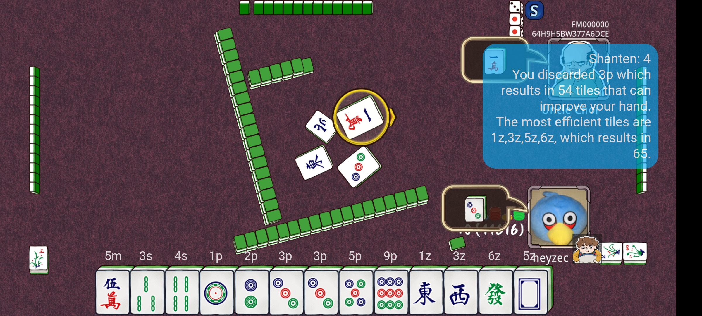

# AutoVision（麻将训练器）

[](https://github.com/shidaxinyyds/001/actions/workflows/build.yml)

AutoVision（麻将训练器）旨在提升你在 [Let's Mahjong](https://play.google.com/store/apps/details?id=com.gdapp.mjlafree&hl=en&gl=US) 中的对局体验，通过实时分析，给出每一手“打哪张牌更优”的策略建议。


_截图：在 Let's Mahjong 对局过程中显示的分析建议_

它的灵感来自 [Euophrys 的麻将效率训练器](https://euophrys.itch.io/mahjong-efficiency-trainer)。

## 功能

- **优化对局决策：** 评估每一张舍牌的策略价值（进张数 / ukeire），帮助你在麻将对局中做出更优的弃牌选择。
- **机器学习技术：** 尝试并实现了多种机器学习方法来定位、检测并分类屏幕上的麻将牌。

## 使用的技术

- **Flutter：** 用于构建 App 的用户界面，包括显示分析建议的悬浮窗层。
- **Python（通过 [Chaquopy](https://chaquo.com/chaquopy/)）：** 每一帧屏幕画面的处理（检测、识别麻将牌）都在设备本地用 Python 完成。
- **OpenCV：** 用于在屏幕上检测和分类麻将牌。

在麻将中，一手牌通常由 13 张组成（轮到你舍牌时为 14 张），牌的种类共 34 种。

为了定位所有牌，程序使用 OpenCV 的 `findContours` 函数寻找轮廓。对全部轮廓的中心点做概率 [霍夫直线变换](https://docs.opencv.org/3.4/d9/db0/tutorial_hough_lines.html)，可以检测出排成一条直线（很可能是玩家手牌）的轮廓。

为了对每张牌进行分类，作者最初尝试了 [SIFT](https://www.wikipedia.com/en/Scale-invariant_feature_transform)（尺度不变特征变换）检测器。但由于不同牌之间（尤其同花色内）存在大量重复图案，分类经常出错。最终采用了**模板匹配**：为 34 种牌分别手动截取游戏内牌面作为模板。

未来希望能探索少样本学习（few-shot learning）和孪生神经网络（Siamese network）。

## 麻将术语表

| 术语 | 说明 |
|---|---|
| [向听数（Ukeire / 进张）](https://riichi.wiki/Ukeire) | 也称“进张数”，指当前手牌还能接收多少张牌来改善牌型（即降低向听数）。本应用正是以此训练用户。（数值越大越好） |
| [向听（Shanten）](https://riichi.wiki/Shanten) | 距离听牌还差几张。任何导致向听数增加的舍牌都会被本应用标出。（数值越小越好） |
| [听牌（Tenpai）](https://riichi.wiki/Tenpai) | 手牌已就绪，即只差一张牌即可和牌 |
| MPSZ 记法 | 描述牌面的简写，例如 `4788m12446s34p26z`。详见此 Reddit 帖子：[链接](https://www.reddit.com/r/Mahjong/comments/dgth5z/is_there_a_standard_notation_for_tiles/) |

> 应用内界面已自动将 MPSZ 记法转换为中文牌名，例如 `4788m12446s34p26z` 会显示为“4万7万8万8万1万2万4万4万6万3筒4筒2字6字”。

## 使用说明

1. 在 Google Play 商店安装 Let's Mahjong App：[链接](https://play.google.com/store/apps/details?id=com.gdapp.mjlafree&hl=en&gl=US)
1. 安装本应用“AutoVision 麻将训练器”（APK 由 GitHub Actions 自动构建，请从工作流运行的 Artifacts 下载）。
1. 打开“麻将训练器”，点击“授权通知”以允许显示通知。这是因为 Android 要求前台服务必须显示一条常驻通知（前台服务用于录制屏幕）。
1. 先确保手机处于横屏模式，再点击“开始识别”，并授予屏幕录制权限。
1. 打开 Let's Mahjong 开始任意一局麻将。快速开始的方法：点击 开始 → 自由对战（Freeplay）进行离线对局。
1. 正常进行对局。每次轮到你舍牌时，屏幕右上角都会出现分析建议。

### 悬浮按钮与悬浮窗

开启识别后，屏幕右上角会出现一个**橙色圆形悬浮按钮（可拖动）**，这就是“悬浮窗按钮”：

- 识别尚未出结果时，按钮内显示转圈加载；一旦识别到牌局，按钮内变为眼睛图标。
- **点击该悬浮按钮**会展开为“分析悬浮窗”，显示当前手牌、向听数以及针对你上一手舍牌的中文点评。
- 在悬浮窗内点击“收起”可缩回为悬浮按钮；点击“停止”会结束识别并关闭悬浮窗。

## 编译说明

1. 确保已具备以下构建环境（使用 [Nix 包管理器](https://www.wikipedia.com/en/Nix_(package_manager)) 的用户可直接运行 `nix develop` 一键安装）：
   - Flutter SDK（3.13.x，与 CI 同版本）
   - Android SDK
   - Python 3
1. 下载 Flutter 依赖：
   ```
   dart pub get
   ```
1. 编译 APK：
   ```
   flutter build apk --release   # 发布包（默认用 debug 签名，可直接安装）
   flutter build apk --debug     # 调试包
   ```
   生成的 APK 位于 `build/app/outputs/flutter-apk/` 目录下。

> 说明：由于本应用通过 Chaquopy 在 Android 内运行 Python，首次构建时 Gradle 会自动下载 OpenCV（约 4.5.1）、Pillow、mahjong 等 Python 包，耗时较长，请耐心等待；请确保网络可访问 Chaquopy 的 PyPI 镜像。

## 平台适配与识别现状（实测数字）

牌面识别已支持多平台：模板按“风格 bank”并存于 `android/app/src/main/python/recognition/templates_*.py`，
每帧先由风格探针 `_probe_style` 路由到对应 bank（接入新平台的唯一引擎改动点见
[`docs/new_platform_onboarding.md`](docs/new_platform_onboarding.md)）。

已挂 bank（模板核共 **594**，现读 `py -3.10 -X utf8 localtest/bank_facts.py`）：
主库 `tencent` 34 类 + 收割 `tencent` 共 121 核 /
`weile` 91 核 33 类 / `queshen` 84 核 29 类 / `zj` 78 核 27 类 / `jj` 77 核 27 类 /
`shushan` 76 核 27 类 / `tuyou` 67 核 24 类。
相对全牌集 34 类的**缺类清单**用 `py -3.10 -X utf8 localtest/bank_coverage.py` 现算，不要引用任何静态数字。

### 平台清单（引擎侧共 8 个，识别覆盖分三档）

下表的“专属 bank / 缺类 / 实测”全部从代码与工具现读（`platforms.py`、`bank_coverage.py`、
`banked_platforms()`），不是人写的常量。**没测过的格子写“无”，不拍脑袋。**

| 平台 key | 显示名 | 专属牌面 bank | 缺类（相对 34 类） | 已有人工 GT（LOFO 样本外，逐张口径） | 识别现状 |
| --- | --- | --- | --- | --- | --- |
| `tencent` | 腾讯欢乐麻将 | 主库 34 类 + 收割 `tencent` 121 核 | 主库 0 / 收割库 1 | **16 帧 184 张 98.9%**（另底座 37 帧样本内 100%） | ✅ 最强，2 错均为字牌邻号/形近抢判 |
| `shushan` | 蜀山四川麻将 | `shushan` 76 核 27 类 | 7 | **10 帧 132 张 100%** | ✅ 已接，缺类限制上限 |
| `weile` | 微乐地方麻将 | `weile` 91 核 33 类 | 1 | **11 帧 127 张 100%** | ✅ 已接，bank 最完整（除腾讯） |
| `tuyou` | 途游四川麻将 | `tuyou` 67 核 24 类 | 10 | **10 帧 116 张 100%** | ✅ 已接（含修掉的整行拒识贴边门） |
| `jj` | JJ 比赛麻将 | `jj` 77 核 27 类 | 7 | **14 帧 152 张 100%** | ✅ 已接 |
| `gd_queshen` | 广东雀神 | `queshen` 84 核 29 类 | 5 | **15 帧 175 张 100%** | ✅ 已接（曾是 76.9%，补库后清零失误） |
| `zj_sichuan` | 指尖四川 | `zj` 78 核 27 类 | 7 | **15 帧 201 张 98.0%**（4 张是 LOFO 剔模板后拿不到框，属素材债） | ✅ 已接（曾用别家字模兜底、无实测） |
| `generic` | 通用平台自适应 | **无**（走腾讯主库兜底） | — | **无** | ❌ 未适配：它的 19 种玩法是**决策层**能力，不等于识别层适配 |

一句话：**8 个平台里 7 个已挂专属牌面 bank 且都有 10 帧以上的样本外人工 GT，
只剩 `generic`（通用自适应）没有识别层实测**（现读清单：`banked_platforms()`）。
GT 合 **91 帧 / 1087 计分格**，另有 76 个读得清但不适合当样本的 `?` 格已出分母。

**下表均为人工钉过 GT 的实测值，每条都可用给出的命令复现；没有数字的格子就是没测过，不猜。**

| 场景 | 实测 | 复现命令 |
| --- | --- | --- |
| 腾讯手牌（底座 37 帧 444 张，**样本内**：bank 就是从这批帧收割的） | 逐张 444/444 = **100%**，整帧精确 37/37，定缺 11/11；阶段 status 36/37 | `py -3.10 localtest/eval_base.py` |
| 蜀山手牌（7 帧 84 张，**样本内**） | 逐张 **82/84 = 97.6%**，整帧 6/7。⚠ 本行**修正了本文档此前声明的「84/84 = 100%、整帧 7/7」**：那个 100% 是拿写错的 GT 量出来的。`s4~s7` 末三枚 GT 原记 `7s7s7s`，而检测器以 **1.00/0.99/0.99** 认成 `5s` —— 满分错认只有"GT 读错"与"bank 贴错标签"两种可能，后者被逐条排掉（shushan bank 内 `5s` vs `7s` 峰值 NCC 仅 **0.77**，非同形；再把四帧这 12 枚与 bank 里 5s/7s 全部变体拼成一张图肉眼比对，牌面是四绿+中心红的**五条**）⇒ GT 改判 `5s5s5s`。**改完门禁仍红**：剩 `s4` 两枚 `3m→2m`（0.78，牌面确为三萬）是修 GT 才暴露的真实缺口，没有靠改断言压绿 | `py -3.10 localtest/eval_shushan.py` |
| 同一底座 37 帧、手牌换回 YOLO 通道（反事实对照，**本轮重跑**） | 逐张 **372/449 = 82.85%**，整帧精确 12/37 ⇒ 通道切换在底座上 **+17.2pt**（NCC 侧同跑仍是 444/444 = 100%、整帧 37/37）。⚠ 这条**修正了本文档此前的 352/449 = 78.40%、6/37（+21.6pt）**：那是 b0 批次的实测，如今跑不出来了 —— YOLO 那条通道本身也随后续改动变过，所以引用它的数字必须重跑而不是抄文档 | `py -3.10 -X utf8 localtest/counterfactual_channels.py` → `build/counterfactual.txt` |
| 同一对照的分层对拍（20 帧子集，只换检测器不动引擎，**本轮重跑**） | 网格 NCC **253/253 = 100%** vs YOLO **231/253 = 91.3%**（文档旧值 220/253 = 87.0% 已跑不出来，与上一条一并更正） | `py -3.10 localtest/layer_cost.py 20 --set base` |
| 牌河（YOLO onnx，合成 1435 张） | recall 1.000 / precision 0.988 / 分类 82.51% | `py -3.10 localtest/eval_river.py` |
| **识别通道口径**（直接驱检测器，量识别上限）：实战素材 **91 帧 / 1087 计分格**，LOFO 逐帧留一 = **样本外** | 逐张 **1081/1087 = 99.4%**、逐位 99.4%；扣 16 张**结构性缺类**后 **1069/1071 = 99.8%**，真失误仅 **2 张**（`3z→2z`、`6z→2p`）；检测层 TP1159/FP1/FN6 ⇒ recall 99.5% / precision 99.9%；人工标 `?` 的 76 格已出分母 | `py -3.10 -X utf8 localtest/eval_new_material.py --lofo --gt localtest/gt/shots_b1.json` |
| **面板口径**（`Engine.process` 出口、每帧新建引擎冷喂 = **保守下限**，同一批帧同一把尺） | 逐张 **1081/1087 = 99.4%**、逐位 **668/668 = 100.0%**（只在框数与 GT 相等的帧上逐位）；整帧集合精确 52/91 = 57.1%，**剔除含 `?` 的脏帧后 52/55 = 94.5%**；面板多吐 77 张 ⇒ 折算精确率 93.4% | `py -3.10 -X utf8 localtest/eval_panel_lofo.py` |
| 上面两行为什么必须一起看 | 通道口径碰不到玩法牌集闸门、置信门槛、稳定器与阶段门控；只报通道数等于把这些层的问题藏进口径 | — |
| 手牌通道对拍（同 7 帧 / 91 张，分层归因，**本轮重跑**） | 模板 NCC **91/91 = 100%** vs 生产 YOLO **73/91 = 80.2%**；面板 S5 **84/91 = 92.3%** ⇒ 冷喂单帧下后处理/阶段门会吃掉 7 张（**更正**：文档旧值 89.0% / 75.8% / "后处理净损失 0 张" 是补库前的账，现已不成立） | `py -3.10 localtest/layer_cost.py 20 --set new` |
| 跨平台泛化（LOFO，307 张裁片） | NCC 80.5%；替代分类器最高 63.2%（train 100% / val 60.6% ⇒ 纯过拟合） | `py -3.10 localtest/cv_eval.py` |
| 面板每帧实付（`Engine.process` 1000 帧连跑，PC，**手牌打分已并行**） | p50 **206.0ms** / p95 678.7ms / p99 1148.1ms / max 1463.1ms；手牌通道占非跳帧总耗时 **66.4%**（并行前 92.0%）；内存 Δ**+6MB**、每 200 帧采样无单调增长；精度衰减 0 帧 | `py -3.10 -X utf8 localtest/bench_latency.py --engine 1000 --fix localtest/shots --platform tencent` |
| **并行收益的唯一可信口径**：逐帧配对 A/B（两台独立引擎吃同一条帧序列，轮次间交替先后，自检跳帧同数 + 逐帧手牌一致） | 腾讯底座 **−303.6ms = −57.5%**、并行胜出 143/144；途游 **−313.0ms = −53.4%**、胜出 71/72；**结果不一致 0 对**。绝对值不可跨进程比较：同配置重复压测 p50 散布 306.9~646.8ms | `py -3.10 -X utf8 localtest/ab_parallel.py 4 --fix localtest/shots --platform tencent --frames 37 --out ab_parallel_tencent.txt` |
| 尾部归因（p95 为什么不跟着并行降） | 最慢 8 帧单帧 648.7ms 而手牌打分只 191ms（**29.4%**），最快 8 帧打分占 83.5%，两组枚数持平 ⇒ 尾部在**决策层向听扫描**（`shanten._run` 单帧 18 万次调用、`advice` 阶段实测 471ms）与个别帧的张数候选膨胀，**并行救不了它** | `py -3.10 -X utf8 localtest/_diag_tail_attribution.py` → `build/tail_attribution.txt` |
| 两条手牌通道耗时（默认夹具 `shots_tuyou` 10 帧同帧中位，PC，**本轮连跑两遍**） | 模板 NCC **268.0 / 273.7ms**、YOLO **391.8 / 365.5ms**（最慢帧 301.9 / 476.2ms）。⚠ 本行**修正旧值「NCC 175.3 / YOLO 103.6（最慢 499 / 125）」，而且方向反了**：旧值里 YOLO 比 NCC 快 1.7 倍，现在 YOLO 反而慢 1.3 倍，两遍一致 ⇒ 不是单次噪声。成因**未定案**（嫌疑是 cv2 的 DNN 后端不再接受 `setPreferableTarget`，日志每帧打 "Targets are not supported by the new graph engine"，YOLO 掉回纯 CPU）。但结论级影响要说清：**"换 YOLO 通道能省时间"这个说法现在不成立**，换通道的账只剩精度那一侧 | `py -3.10 -X utf8 localtest/bench_latency.py --channels` → `build/channels.txt` |
| 各 bank 缺类覆盖（相对 34 类全牌集） | 收割 tencent bank 缺 1 / shushan 7 / queshen 5 / tuyou 10 / jj 7 / weile 1 / zj 7（主库 tencent 0） | `py -3.10 -X utf8 localtest/bank_coverage.py` |

→ 上面这两行是**现算快照**（2026-10 本轮），数字会随补库变化；复现命令就在第三列。

完整的平台分布、混淆对、典型误判样例与 98% 可行性数学见
[`docs/accuracy_report_2026-10.md`](docs/accuracy_report_2026-10.md)。

因此本项目**不对外声明"某平台准确率 98%"这种笼统数字**，只声明可核对的部分：
0 失误下 95% 单侧置信下界约为 `1 - 3/n`，要主张 ≥98% 需要**每平台 ≥150 张且不报错**。
按现行 91 帧 / 1087 格的 LOFO 实测：`gd_queshen` 175 张 0 错（下界 **98.3%**）、
`jj` 152 张 0 错（**98.0%**）、`weile` 127 张 0 错（97.6%）、`shushan` 132 张 0 错（97.7%）、
`tuyou` 116 张 0 错（97.4%）；而 `tencent`（2 错）与 `zj_sichuan`（4 张漏框）
**不到 98% 下界**，`generic` 没有任何数据。合起来能说出口的只有一句：
**7 个已接平台的样本外逐张精度 99.4%（1081/1087），其中 5 个平台 0 失误。**

拒识（"零失误出牌建议"的唯一现实路径）在现行样本上比历史批次便宜得多：
门限 **0.45 只拒 3/1071 张（0.3%）就能做到保留内 100% 正确**；但正确张 min **0.39**
与错误张 max **0.40 仍然重叠**，所以"低分标灰"不是全风险兜底 —— 那 2 个真失误
（`3z→2z`、`6z→2p`）分数是 0.38 / 0.40，靠阈值挡不住，只能靠补类与配准。

## 已知限制

- 牌面识别依赖针对各平台牌面裁剪的模板：未挂 bank 的平台、以及已挂 bank 里**缺失的标签**
  （`py -3.10 -X utf8 localtest/bank_coverage.py` 可现算：途游缺 10 类、蜀山/JJ/指尖各 7 类、
  雀神 5 类、微乐与腾讯收割库各 1 类）会被退到候选集内最高分，表现为低分认错、
  甚至认成别家平台的牌。只要目标帧里会出现缺类，该平台的准确率就有硬上限，
  这类问题靠按 SOP 第 4/5 步补样本解决，不是靠换算法或调阈值。
- 已挂本家 bank 的平台，手牌行走模板 NCC 通道（`Engine.get_hand_detector`）；牌河/副露/
  阶段探测仍走主检测器（YOLO）。通道对拍（7 帧 91 张，本轮重跑）：NCC **100%** vs YOLO
  **80.2%**，面板出口 **92.3%**（补库前是 89.0% / 75.8%，旧对比已作废，见上表）。
- 风格探针（不声明平台时的自动路由）实测**不可依赖**：在 4 帧已人工钉风格的样本上只判对 2/4。
  所以生产上必须先选平台；离线评测也必须按帧声明平台，否则测到的是不存在的链路。
- 单帧识别耗时：**50ms/帧的目标在现行架构下不可达**（PC 面板实付 p50 206ms 就已超 4.1 倍，
  p95 679ms 超 13.6 倍）。手牌逐枚打分并行后 **350ms 在 PC 上是"中位达标、尾部不达标"**
  （p50 206.0ms / p95 678.7ms / p99 1148.1ms）；尾部经逐帧归因确认**不在手牌打分**
  （慢帧里打分只占 29%），而在决策层的向听扫描与个别帧的张数候选膨胀，
  并行救不了它。更关键的两条边界：① 本机绝对值**不可复现**（同配置重复压测 p50
  散布 306.9~646.8ms），所以并行收益只报同进程配对值（**−53%~−58%、胜率 99%、
  逐帧结果 0 差异**）；② **手机端一行都没测过**，Chaquopy 的 CPU 弱一个量级，
  350ms 能不能算交付必须由设备实测回答。详见上方表格的命令与输出。
- 两条已知但**本轮没擅自做**的省时/精度取舍：① 把分类候选集从"本家+蜀山+主库"收到
  "本家+主库"可再省约 35% 调用，但未建 bank 的平台正靠 tencent/shushan 兜底，收窄会伤
  陌生平台泛化；② 配准饱和——60.8~66% 的 NCC 峰值贴在 13×13 搜索窗最外圈，说明最优对齐
  可能在窗外，修它要扩窗，反而更慢。两者都需要用户先定"精度 vs 速度"的接受点。
- **人工 GT 本身会被量错，而且错的时候分数是满的**：本轮 `eval_shushan` 从"84/84 = 100%"
  变成"82/84 = 97.6%"，起因不是识别退化，而是**门禁 GT 里有 12 张标签写错**
  （`s4~s7` 的 `7s7s7s` 实为 `5s5s5s`，靠拼图肉眼定案，证据链见
  `docs/accuracy_report_2026-10.md` §11.11）。这类债的信号是"满分错认"——分数帮不了你。
  所以本文档里**每一个 100% 都必须连着它的 GT 来源和复现命令一起读**，单独引用一个
  百分数没有意义。全量回归现状：**31/33**（`eval_base` 一条既有 status 红项 +
  `eval_shushan` 修 GT 后剩下的 2 张真失误）。
- 屏幕录制与悬浮窗权限由系统弹窗申请，弹窗文案跟随系统语言，无法通过本应用修改。
- 本应用仅用于练习与分析，不影响游戏本身的逻辑与结果。
