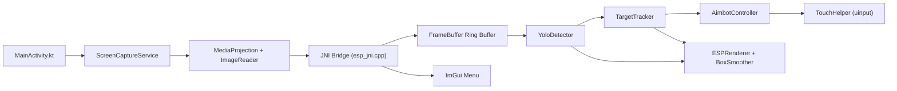
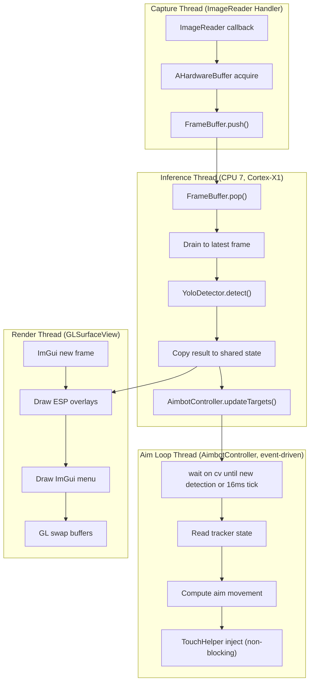
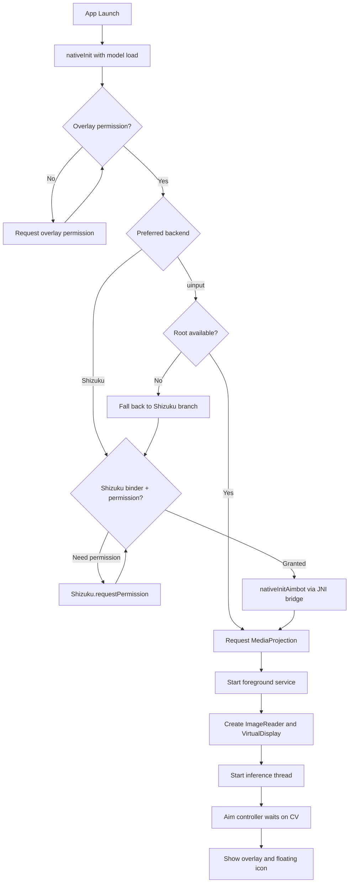
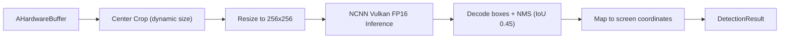
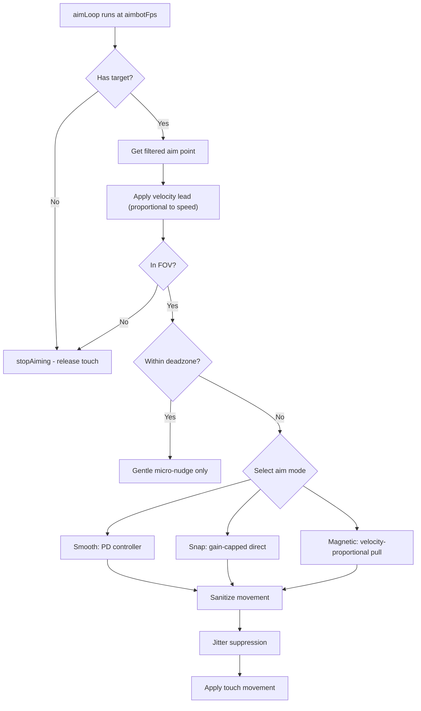

# Architecture

How AimBuddy works as an AI-based Android aim assistant, covering module responsibilities, data flow, threading, and safe change points.

## System Overview

AimBuddy runs as two cooperating layers:

- **Android layer (Kotlin)**: permissions, lifecycle, foreground service, screen capture, and overlay hosting.
- **Native layer (C++)**: frame ingestion, YOLO inference, target tracking, overlay rendering, and optional input assistance.

Two runtime modes:

| Mode | Root Required | Features |
|------|---------------|----------|
| Visual Assist | No | Capture, inference, tracking, ESP overlays |
| Assisted Input | Yes | Everything above plus touch injection |

## High-Level Data Flow

## Threading Model

AimBuddy uses four threads at runtime. Each runs on a specific CPU core for deterministic scheduling on Snapdragon SoCs.

### Thread Synchronization

| Shared Resource | Protection | Threads |
|----------------|------------|---------|
| FrameBuffer | Lock-free SPSC ring buffer (4 slots) | Capture to Inference |
| g_latestResult | std::mutex | Inference to Render |
| TargetTracker state | std::mutex (m_trackerMutex) | Inference to Aim Loop |
| g_settings (UnifiedSettings) | Relaxed copy-on-read | All threads |

## Frame Pipeline

The pipeline from screen capture to detection output:

1. **Capture**: `ImageReader` callback fires per frame at device refresh rate. Frame pushed as `AHardwareBuffer` into `FrameBuffer` (lock-free SPSC ring buffer, capacity 4).
2. **Drain**: Inference thread pops the ring buffer and drains to the latest frame, releasing stale buffers. This ensures inference always processes the most recent capture.
3. **Preprocess**: Center crop the capture buffer around screen center. Crop size is dynamic based on `fovRadius` and adaptive pressure.
4. **Inference**: NCNN Vulkan runs YOLOv26n (256x256 input, FP16) on the cropped region. Target cycle time: 8ms.
5. **Postprocess**: Decode boxes, apply NMS (IoU 0.45), and map coordinates from crop space back to screen space.
6. **Distribute**: Detection result is copied to shared state for the render thread and forwarded to the aimbot target tracker.

### Adaptive Crop

The inference loop dynamically adjusts the crop size using two pressure signals:

- Latency pressure: EMA inference exceeds target cycle, or EMA end-to-end latency exceeds target threshold.
- Backlog pressure: one or more buffered frames were drained in the current iteration.

Adjustment rules:

- If either pressure signal is active, crop size shrinks by 16px (minimum 224px).
- If pressure is clear and crop is below the current FOV-derived target, crop grows by 8px.
- This adapts automatically to different GPU speeds without manual tuning.

## Android Layer

| File | Responsibility |
|------|---------------|
| `MainActivity.kt` | Startup, permission sequence (overlay, root, MediaProjection), native lifecycle control (`nativeInit`, guarded `nativeInitAimbot`) |
| `ScreenCaptureService.kt` | Foreground service for MediaProjection, JNI bridge for frame delivery |
| `ImGuiGLSurface.kt` | OpenGL ES surface hosting ImGui render pass, touch event routing |
| `RootUtils.kt` | Root availability checks, `/dev/uinput` permission setup |

### Permission Sequence

## Native Layer

Path: `app/src/main/cpp`

| Directory/File | Responsibility |
|----------------|---------------|
| `esp_jni.cpp` | JNI entry point, thread lifecycle, inference loop, global state management |
| `settings.h` | Compile-time constants (capture size, model config, NCNN flags, thread affinity) |
| `detector/yolo_detector.*` | NCNN model loading, Vulkan inference, preprocess and postprocess |
| `detector/bounding_box.h` | BoundingBox struct with IoU, center, and coordinate helpers |
| `aimbot/target_tracker.*` | DeepSORT-style multi-target tracking with IoU + center distance matching |
| `aimbot/aimbot_controller.*` | Three aim modes (smooth, snap, magnetic), PD controller, velocity lead, touch injection |
| `input/touch_helper.*` | Linux uinput device creation, touch down/move/up injection |
| `renderer/esp_renderer.cpp` | ESP overlay rendering (boxes, snap lines, FOV circles) |
| `renderer/overlay_window.*` | EGL window/surface lifecycle for native overlay render path |
| `renderer/imgui_menu.cpp` | Full ImGui settings menu with presets, live editing, auto-save |
| `renderer/box_smoothing.h` | Temporal EMA smoothing for ESP box rendering (separate from aimbot filtering) |
| `utils/aimbot_types.h` | UnifiedSettings struct, TrackedTarget struct, math helpers, FixedArray |
| `utils/detection_zone.h` | Detection zone metric helpers used by renderer and UI |
| `utils/imgui_helper.h` | Shared ImGui draw/color helper utilities |
| `utils/vector2.h` | 2D vector math |
| `utils/logger.h` | Android logcat macros with build-mode filtering |
| `utils/timer.h` | High-resolution timing |
| `utils/thread.h` | Thread wrapper with CPU affinity support |
| `utils/memory_pool.h` | Pre-allocated memory pool for zero-allocation hot paths |

## Detection Pipeline

Key configuration from `settings.h`:

| Parameter | Value | Purpose |
|-----------|-------|---------|
| CAPTURE_WIDTH/HEIGHT | 1280x720 | Capture resolution (SD for performance) |
| CROP_SIZE | 480 | Max center crop region |
| MODEL_INPUT_SIZE | 256 | NCNN input resolution |
| IMAGE_READER_MAX_IMAGES | 3 | Triple buffering |
| NMS_IOU_THRESHOLD | 0.45 | Non-maximum suppression |
| NUM_CLASSES | 1 | Single class (enemy) |

## Tracking Pipeline

TargetTracker uses a DeepSORT-inspired approach:

1. **Predict**: Existing tracks are moved forward using tracked velocity.
2. **Matching Cascade**: Tracks matched to detections by age (younger first), using combined IoU + center distance + area ratio scoring.
3. **Unmatched Tracks**: Lost counter incremented, velocity decayed. Tentative tracks dropped after 1 miss. Confirmed tracks dropped after `maxLostFrames` (default 8).
4. **New Tracks**: Unmatched detections create tentative tracks. Promoted to confirmed after 3 consecutive matches.

### Target Selection

`getBestTargetCopy()` selects the best track with hysteresis:

- Only CONFIRMED enemy tracks within `aimFovRadius` are candidates.
- Priority modes: nearest to crosshair, largest box, or highest confidence.
- Locked target gets a switch threshold (default 1.3x better required to switch).
- Switch cooldown prevents rapid target flickering.

## Aim Control Pipeline

### Aim Modes

| Mode | Behavior | Best For |
|------|----------|----------|
| Smooth (0) | PD controller with convergence damping, derivative brake | General use, natural feel |
| Snap (1) | Gain-capped proportional, fast acquisition | Fast response, competitive |
| Magnetic (2) | Distance-proportional pull, gentle near lock | Precision, minimal overshoot |

### Input Injection

Two backends, both designed so the aimbot pointer coexists with user fingers - never replacing or blocking them.

**Root (uinput)**

1. Probes the real touchscreen via `/dev/input/event*` to copy ABS axis ranges, bus id, and physical-location string.
2. Opens `/dev/uinput` and creates a *separate* virtual multitouch device named `aimbuddy-virtual-touch`.
3. Emits Type B multitouch events on slot 0 with a fixed tracking id (`0x7000`) that can never collide with ids the kernel allocates to physical fingers.
4. The real touchscreen is **never grabbed** (`EVIOCGRAB` removed). The kernel reports both devices to InputDispatcher, so the aim pointer and the user's fingers are dispatched as two parallel streams.
5. Touch is constrained to a configurable radius around a center point so the synthetic pointer behaves like a thumb on the aim stick.

**Non-root (Shizuku)**

1. Resolves `IInputManager.injectInputEvent` from a Shizuku-authorized process via reflection.
2. Synthesizes `MotionEvent`s with `deviceId = -1` (virtual) and a high pointer id (`19`) - both deliberately distinct from physical-touchscreen ids so InputDispatcher routes the synthetic gesture as a parallel stream rather than merging it into the user's pointer history.
3. Uses `INJECT_MODE_ASYNC` so injection never blocks the aim loop.
4. The Kotlin injector keeps a running `downTime` for the aim gesture so the OS treats `ACTION_DOWN`/`ACTION_MOVE`/`ACTION_UP` as a single uninterrupted contact.

This means moving the player and aiming can happen at the same time. The user's finger on the move pad and the aimbot's contact on the look pad are both live; either can be released without affecting the other.

### Streamer Mode

`UnifiedSettings.streamerMode` (toggled from the overlay menu) marks the ESP/menu windows with `WindowManager.LayoutParams.FLAG_SECURE`. While enabled, Android excludes the overlay from MediaProjection captures, screen recorders, screenshots, and mirroring - the game is captured as usual, but the overlay is stripped to a black surface in the recorded output.

## Settings System

All runtime settings live in `UnifiedSettings` (defined in `utils/aimbot_types.h`):

- Binary serialized to `/data/local/tmp/settings.bin`.
- Magic number `0xE5BA1005` for format validation.
- `validate()` clamps all values to safe ranges before hot-path use.
- Settings are read by copy (snapshot) in each thread to avoid contention.
- Auto-saved after a short delay following menu edits.

## Runtime Contracts

- `UnifiedSettings` values are validated with `validate()` before every hot-path usage.
- Render and control coordinate spaces stay aligned through centralized projection logic.
- Stop and restart paths are idempotent to prevent lifecycle race failures.
- Non-root mode always keeps the visual pipeline functional.
- Zero-detection fast-release: touch is released immediately when no enemies are detected.

## Safe Change Guide

| What to Change | Where to Look |
|----------------|---------------|
| Permission or startup behavior | `MainActivity.kt`, `RootUtils.kt` |
| Capture resolution or buffering | `settings.h`, `MainActivity.kt` |
| Detection model or preprocessing | `detector/` |
| Tracking association or lock logic | `aimbot/target_tracker.*` |
| Aim modes or motion control | `aimbot/aimbot_controller.*` |
| Touch injection mechanism | `input/touch_helper.*` |
| ESP overlay rendering | `renderer/esp_renderer.cpp`, `renderer/box_smoothing.h` |
| Menu layout and presets | `renderer/imgui_menu.cpp` |
| Defaults, clamping, persistence | `settings.h`, `utils/aimbot_types.h` |

## Related Documentation

- [Settings Guide](SettingsGuide.md)
- [Performance](Performance.md)
- [Training](Training.md)
- [Troubleshooting](Troubleshooting.md)
