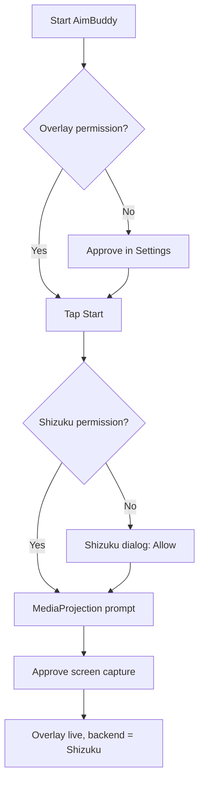

# Shizuku Setup Guide

This guide walks you through getting [Shizuku](https://shizuku.rikka.app/) running on your phone so AimBuddy can perform touch injection without root. If you already have a rooted device you can skip this entirely and use the `uinput` backend.

The whole process takes about 5 minutes the first time. You only have to do it once per device boot (Shizuku keeps running until you reboot the phone).

## Why Shizuku?

Android does not let normal apps simulate touches in other apps. There are two ways around that:

1. **Root.** A rooted device can open `/dev/uinput` and create a virtual touchscreen. AimBuddy already supports this.
2. **Shizuku.** An app that briefly receives elevated permissions through ADB (or a one-time root grant). Once Shizuku is running, *other* apps can use those permissions through Shizuku's binder. AimBuddy uses it to call the hidden `IInputManager.injectInputEvent` API.

Both paths produce the same result: a synthetic touch contact that runs in parallel with your finger. The only difference is that Shizuku does not require permanently rooting the phone.

## What you need

- An Android phone, version 11 or newer.
- A USB cable, OR a PC on the same Wi-Fi network as the phone (for wireless ADB).
- About 50 MB free for the Shizuku app.

## Step 1: install the Shizuku app

Pick one of these. The Play Store version updates automatically, which is the easiest path.

| Source | How |
|---|---|
| Google Play | Search "Shizuku" by Rikka, install. |
| GitHub release | Download the latest APK from https://github.com/RikkaApps/Shizuku/releases and sideload. |

Open the app once after installing so it can finish first-run setup. You will see a screen that says "Shizuku is not running". That is normal. Pick a way to start it below.

## Step 2A: start Shizuku via wireless debugging (Android 11+, no PC)

This is the easiest method. You do not need a computer.

1. On the phone, open **Settings -> About phone**. Tap **Build number** seven times until the toast says "You are now a developer".
2. Go back to **Settings -> System -> Developer options**.
3. Scroll down and enable **Wireless debugging**. Tap it to open its detail screen, leave it open.
4. Open the Shizuku app. Tap **Pair device with QR code** (under "Start via Wireless debugging").
5. Back in Wireless debugging on the system settings page, tap **Pair device with QR code**.
6. Point the camera at the QR shown by Shizuku. Once paired, Shizuku will start the service automatically.
7. Pull down the notification shade. You should see a persistent "Shizuku is running" notification.

The Shizuku app now shows a green check and the running version number. Skip ahead to Step 3.


## Step 2B: start Shizuku via ADB from a PC

Use this if Step 2A does not work or your phone is below Android 11.

1. Install platform-tools on your PC: https://developer.android.com/tools/releases/platform-tools
2. Enable **USB debugging** in Developer options on the phone.
3. Plug the phone into the PC. Approve the "Allow USB debugging?" prompt that appears the first time.
4. From the PC terminal, verify the phone is visible:
   ```bash
   adb devices
   ```
   You should see one entry that is not "unauthorized". If it is unauthorized, accept the prompt on the phone.
5. Run the Shizuku start script:
   ```bash
   adb shell sh /sdcard/Android/data/moe.shizuku.privileged.api/start.sh
   ```
   If that path is not found, the Shizuku app's home screen also shows the exact command to run for your install. Copy-paste it.
6. The terminal prints something like `info: shizuku_starter started.` and exits.
7. On the phone, the Shizuku app turns green and the persistent notification appears.

## Step 2C: start Shizuku from a rooted phone (alternative)

If your phone is already rooted, the Shizuku app exposes a one-tap **Start (root)** button. The service then runs under elevated privileges without any ADB dance.

## Step 3: grant AimBuddy permission

1. Open AimBuddy.
2. Tap **Start**.
3. On the first launch, AimBuddy asks for the overlay permission. Approve it.
4. AimBuddy then asks Shizuku for permission. Shizuku pops a dialog that says "Allow AimBuddy to use Shizuku?". Tap **Allow**.
5. AimBuddy asks for the MediaProjection (screen-capture) permission. Approve.
6. The overlay appears. The Aim tab will show **Backend status: ready** under Shizuku.

You only have to grant the Shizuku permission once. AimBuddy will reuse it on every launch.



## What happens after a reboot

Shizuku **stops** when you reboot the phone. You need to start it again using whichever method from Step 2 worked the first time.

The Shizuku app remembers the wireless-debugging pairing, so on Android 11+ you usually only need to:

1. Enable wireless debugging in Developer options.
2. Open Shizuku - it auto-reconnects within a few seconds.

Some custom ROMs (HyperOS, ColorOS, MIUI) revoke wireless-debugging pairings on reboot. On those, repeat the QR pairing once after every restart. There are workarounds (paid Tasker scripts, etc.) but AimBuddy itself can do nothing about that - it is a Shizuku and OS limitation.

## Troubleshooting

### "Backend status: Shizuku unavailable" in the Aim tab

The Shizuku service is not running. Open the Shizuku app and check the status. If it shows "not running", repeat Step 2.

### Shizuku permission dialog never appears

This usually means the binder did not establish. Try:

1. Force-stop both Shizuku and AimBuddy.
2. Re-open Shizuku, confirm it still shows running.
3. Re-open AimBuddy and tap Start again.

### "binder dead" toast inside AimBuddy

The Shizuku service crashed or was killed by the OS (low memory / aggressive battery saver). Re-start it via Step 2 and press Start in AimBuddy again.

### Touch is laggy or drops contacts on a specific game

Some games actively block synthetic input. There is no clean workaround; switch to the root/uinput backend if your phone supports it, or test a different game.

### Phone is below Android 11

You cannot use wireless debugging. Use Step 2B (USB cable) or Step 2C (root).

### Aggressive battery management kills Shizuku

Add Shizuku to your phone's "do not optimize" / "auto start" / "background activity" list. The exact menu name varies by OEM:

| OEM | Menu path |
|---|---|
| Samsung | Settings -> Apps -> Shizuku -> Battery -> Unrestricted |
| Xiaomi (HyperOS / MIUI) | Settings -> Apps -> Manage apps -> Shizuku -> Battery saver -> No restrictions; Autostart -> on |
| OnePlus / Oppo | Settings -> Battery -> Battery optimization -> Shizuku -> Don't optimize |
| Stock Android | Settings -> Apps -> Shizuku -> Battery -> Unrestricted |

Do the same for AimBuddy itself - otherwise the OS may kill the foreground capture service mid-session.

## Verifying everything works

Open AimBuddy, tap Start, and check the Aim tab:

- **Backend** dropdown: Shizuku (Non-root)
- **Backend status**: ready

If both are true, you are done. Enable Aim Assist and try a game. You should see the aimbot touch overlap your own finger without either being dropped.

## Going further

- [Shizuku official docs](https://shizuku.rikka.app/) explain other use cases.
- [Architecture - Input Injection section](Architecture.md) explains how AimBuddy talks to Shizuku internally and why we use a virtual device id.
- [Troubleshooting](Troubleshooting.md) covers issues that are not specific to Shizuku.
