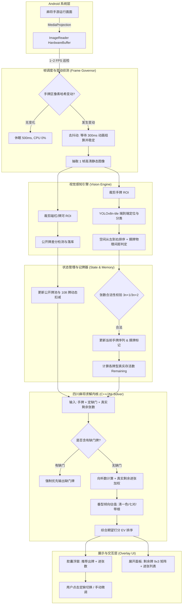

# Android 实时麻将视觉分析系统 (v3.0 工业级技术规约与架构设计)

> **设计宗旨**：杜绝低效的传统图像切块与全量截屏，构建**事件驱动（零冗余计算）+ 局部轻量端到端检测（零切分误差）+ 全规则川麻决策内核（定缺/真实存活牌效/番型EV）**的最优架构。

---

## 目录
1. [系统整体架构与数据流图](#1-系统整体架构与数据流图)
2. [底层屏幕捕获与帧调度引擎 (Frame Governor)](#2-底层屏幕捕获与帧调度引擎-frame-governor)
3. [视觉感知与特征提取引擎 (Vision Perception Engine)](#3-视觉感知与特征提取引擎-vision-perception-engine)
4. [牌局状态机与动态记牌器 (Game State & Tile Memory)](#4-牌局状态机与动态记牌器-game-state--tile-memory)
5. [四川麻将求解器 (Sichuan Mahjong Solver)](#5-四川麻将求解器-sichuan-mahjong-solver)
6. [悬浮窗与交互式标定系统 (Overlay & Calibrator)](#6-悬浮窗与交互式标定系统-overlay--calibrator)
7. [异常处理、容错与稳定性机制](#7-异常处理容错与稳定性机制)
8. [分阶段落地实施路线图](#8-分阶段落地实施路线图)

---

## 1. 系统整体架构与数据流图



---

## 2. 底层屏幕捕获与帧调度引擎 (Frame Governor)

### 2.1 性能与功耗核心痛点解决
常规方案每秒持续全屏抓取并转成 Java Bitmap，5 分钟就会引发 CPU 降频与内存卡顿。本系统采用**两级节流与事件驱动（Event-driven）**机制：

1. **巡检模式 (Idle Polling, 1~2 FPS)**：
   - 仅对上次配置的“手牌 ROI”区域进行极小比例（如 $32 \times 8$）降采样灰度感知哈希（pHash）比对。
   - 均方差（MSE）低于阈值时，说明玩家手牌未发生变动，直接跳过推理，CPU 占用率 $< 1\%$。
2. **去抖动稳定判定 (Settling / Debounce Window)**：
   - 当手牌区哈希突变（说明正在出牌或刚抓进一张牌），画面常伴有摸牌弹起、出牌划屏动画、高亮光圈（持续 200~400ms）。
   - 系统延迟 150ms 重新检测，直到连续 2 次采样差值趋于 0（静止），确认牌面动画完全定格。
3. **高精单帧抽取 (High-Precision Capture)**：
   - 触发静态稳定后，通过 NDK 直接获取 `AHardwareBuffer`，将对应 ROI 送入推理，不经过 Java Bitmap 内存创建，杜绝 GC 顿挫。

### 2.2 屏幕坐标与全屏沉浸式映射
麻将游戏 100% 为横屏沉浸式（隐藏状态栏与导航栏），挖孔屏和旋转角度极易导致触摸坐标与真实物理像素错位：
* **标准归一化坐标系**：所有 ROI 框（$x, y, w, h$）均存储为相对于逻辑画面的归一化浮点比率 $[0.0 \sim 1.0]$。
* **DisplayCutout 补偿**：捕获时读取系统的 `WindowInsets` 安全边距（Safe Insets），自动剔除挖孔与黑边，确保换机型、不同长宽比分辨率完美自适应。

---

## 3. 视觉感知与特征提取引擎 (Vision Perception Engine)

### 3.1 抛弃传统切块，采用端到端 YOLOv8n-tile
原方案中“OpenCV 轮廓检测切图 + CNN 分类”在粘连、重叠、倾斜的手牌画面上致命不可行。
* **输入设计**：仅将裁剪后的手牌长条图（如 $1080 \times 160$）输入模型，Resize 为宽屏适配尺寸（$640 \times 128$），相比全屏 $640 \times 640$ 算力节约 **80%**。
* **模型架构**：
  * **YOLOv8n-tile**（或 MobileNetV4-YOLO），导出为 INT8 量化 NCNN / ONNX 模型。
  * 体积：约 **2.8 MB**；推理耗时：在 Snapdragon 8 Gen 1/2 上仅需 **12 ~ 18 ms**。
  * 类别体系：27 类（1~9万、1~9条、1~9筒）或 34 类（兼容带字牌的其他规则）。
* **直接输出**：单次前向直接输出所有手牌的边界框 $[x_c, y_c, w, h]$、类别 `class_id` 与置信度 `conf`。

### 3.2 空间几何排序与摸牌（第 14 张）判定算法
```python
def parse_and_sort_hand(detected_boxes):
    # 1. 按照中心点 x 坐标从左往右排序
    sorted_tiles = sorted(detected_boxes, key=lambda b: b.x_center)
    
    # 2. 计算相邻牌中心距的均值与中位数
    diffs = [sorted_tiles[i+1].x_center - sorted_tiles[i].x_center for i in range(len(sorted_tiles)-1)]
    median_diff = np.median(diffs)
    
    # 3. 摸牌独立判定 (四川麻将 14/11/8/5/2 张摸牌状态)
    # 若最后一张牌与前一张的间距明显大于正常排列间距（如 > 1.35 * median_diff）
    is_drawing = False
    if len(sorted_tiles) in [2, 5, 8, 11, 14]:
        if diffs[-1] > 1.35 * median_diff:
            sorted_tiles[-1].is_new_draw = True
            is_drawing = True
            
    return sorted_tiles, is_drawing
```

---

## 4. 牌局状态机与动态记牌器 (Game State & Tile Memory)

### 4.1 牌池绝对守恒模型
四川麻将（108 张牌，无风无花）各牌张数固定为 4。
$$\forall t \in [1\text{万} \dots 9\text{筒}], \quad \text{Remaining}(t) = 4 - \text{Hand}(t) - \text{Visible}(t)$$
其中公开牌 $\text{Visible}(t)$ 包含：
1. **自己碰杠区**；
2. **三家对手碰杠区**（若用户框选了碰杠监控区）；
3. **四家公共牌河弃牌区**。

### 4.2 动静增量与单调累加器 (Monotonic Accumulator)
为了防止出牌特效遮挡导致已出牌“被误判抹除”：
* **公开牌池只增不减**：一旦某张牌在牌河/碰杠区被连续 2 次识别确认，永久计入已见集合。
* **总数硬性越界拦截**：若某张牌 $\text{Hand}(t) + \text{Visible}(t) > 4$，触发冲突抑制策略，自动降低低置信度检测结果的权重，优先相信手牌检测。

---

## 5. 四川麻将求解器 (Sichuan Mahjong Solver)

本求解器采用 C++ 核心库通过 JNI 桥接，兼顾极致性能（单次计算 $< 1\text{ms}$）与川麻专属规则。

### 5.1 规则 1：定缺天条门控 (DingQue Policy)
在四川麻将中，未打完缺门牌绝对无法叫听或胡牌，违者算“花猪”重罚。
1. **状态存储**：记录当前定缺门 $D \in \{\text{WAN}, \text{TIAO}, \text{TONG}\}$。
2. **强制门控**：
   $$\text{Hand}_{que} = \{t \in \text{Hand} \mid \text{Color}(t) == D\}$$
   * 若 $\text{Hand}_{que} \neq \emptyset$，**出牌推荐候选集强制缩减为 $\text{Hand}_{que}$**！
   * 缺门出牌优先级排序：孤张偏张（1, 9） > 孤张中张（2~8） > 坎张搭子 > 对子。
   * 完全屏蔽对保留门花色的任何破坏操作。

### 5.2 规则 2：真实存活牌效（基于剩余牌权重）
常规牌效算法假设山里每张未见牌均匀分布。本系统使用**动态记牌池权重**计算向听进张：
$$S(discard) = \sum_{t \in \text{EffectiveTiles}(discard)} \text{Remaining}(t)$$
* **实例对比**：
  * 打出 A，理论进张为 3万、6万（理论共 8 张，但记牌器发现外面已见 7 张，真实仅剩 1 张）。
  * 打出 B，理论进张为 2筒（理论共 4 张，外面见 0 张，真实存活 4 张）。
  * **决策输出**：系统果断推荐打出 A，保留存活进张高达 4 张的搭子。

### 5.3 规则 3：番型估值与期望收益 (EV Ranking)
四川麻将极其看重大番（清一色、七对、带根）。纯牌效往往引导出“无番屁胡”。
系统引入番型倾向打分模型：
$$\text{Score}(discard) = \text{ShantenBenefit} + \lambda_1 \cdot \text{RealAcceptance} + \lambda_2 \cdot \text{FanPotential}$$
* **清一色诱导因子**：当手牌中主花色牌张数 $\ge 8$ 张，清一色权重 $\lambda_2$ 激增，允许牺牲 1 向听数以逼退杂色。
* **七对子比选**：当对子数 $\ge 4$ 个时，同步并行评估七对子向听树与面子手向听树，输出期望更优的一条路线。
* **带根/刮风下雨诱导**：对已持有的 3 张同花色牌（暗刻），调高碰杠倾向度，保留开杠番型倍增机会。

---

## 6. 悬浮窗与交互式标定系统 (Overlay & Calibrator)

### 6.1 悬浮 UI 状态分级
1. **轻量胶囊态（默认，极少遮挡画面）**：
   * 展示：`打 [九筒] 进张 12张 (存活10张)`
   * 状态指示灯：绿色（手牌正常识别）、橙色（正在平滑校验）、红色（张数异常）。
   * 定缺快捷徽章：点击可直接一键切换定缺门（万/条/筒）。
2. **全展开决策态（点击胶囊后展开）**：
   * **进张排行榜**：列出打出各张牌的向听数改善情况与存活进张张数对比。
   * **9x3 剩余牌矩阵仪表盘**：直观高亮显示万、条、筒各张牌的场上存活余量（0张标红变灰，防点炮与绝张参考）。

### 6.2 交互式多区域标定器 (Region Calibrator)
* **全屏冻结编辑遮罩**：截取当前帧静态背景，提供半透明操作层。
* **智能比例预设**：内置腾讯欢乐麻将、指尖麻将主流机型预置模板，用户只需一键加载默认模板微调。
* **微调工具箱**：提供“上/下/左/右 1 像素微调手柄”和“放大镜预览框”，彻底解决手指遮挡和精度问题。

---

## 7. 异常处理、容错与稳定性机制

| 异常场景 | 潜在危害 | 工业级解决方案 |
| :--- | :--- | :--- |
| **摸牌时手牌处于弹起状态** | Y 坐标错位、局部阴影导致漏检 | 模型训练集加入垂直位移数据增强；检测器支持多尺度包围盒，按 X 轴投影聚合 |
| **出牌飞行动画/碰杠遮挡** | 截取到半透明牌或光晕特效导致误检 | **动静去抖动 (Settling Window)**：连续采样直到像素差异接近零才触发识别 |
| **识别张数不合法 (如检出12张)** | 牌效算法崩溃，输出错误建议 | **张数校验门禁**：仅当检测张数处于 $\{2,5,8,11,14\}$（出牌态）或 $\{1,4,7,10,13\}$ 时通过；否则维持上一帧结果并在浮窗显示警告 |
| **单种牌检出超过 4 张** | 牌池负数，逻辑冲突 | 置信度消歧过滤器：保留 Top 4 置信度框，过滤多余误检 |
| **手机过热 / 后台进程限制** | 浮窗服务被系统 LowMemoryKiller 杀掉 | 注册前台服务（Foreground Service）并挂载通知；利用变动触发实现极低功耗 |

---

## 8. 分阶段落地实施路线图

```
┌────────────────────────────────────────────────────────────────┐
│  Phase 1: 离线算法与模型验证 (PC端 / Python)                     │
│  - 采集 30~50 张主流手游手牌截图                                │
│  - 标注并微调轻量 YOLOv8n-tile 模型，验证识别准确率 (目标 >99%)  │
│  - 实现川麻 C++ 牌效 Solver (定缺、真实余量、向听期望)          │
└───────────────────────────────┬────────────────────────────────┘
                                │ 验证通过
                                ▼
┌────────────────────────────────────────────────────────────────┐
│  Phase 2: Android 核心采集与悬浮配置层 (Kotlin / NDK)           │
│  - 搭建 MediaProjection 投屏捕获服务与 ImageReader 零拷贝通道   │
│  - 实现横屏沉浸式微调标定遮罩 (RegionCalibrator)               │
│  - 完成配置 Profile 本地持久化 (JSON / Room)                    │
└───────────────────────────────┬────────────────────────────────┘
                                │
                                ▼
┌────────────────────────────────────────────────────────────────┐
│  Phase 3: 端侧推理与状态同步集成 (NCNN / C++ JNI)               │
│  - 模型转 NCNN INT8/FP16，集成端侧推理动态库                   │
│  - 接入 Frame Governor 动静帧调度器，测试发热与功耗             │
│  - 联调手牌空间排序与合法性校验过滤器                           │
└───────────────────────────────┬────────────────────────────────┘
                                │
                                ▼
┌────────────────────────────────────────────────────────────────┐
│  Phase 4: 完整决策链路与 UI 交付 (Jetpack Compose)             │
│  - 悬浮胶囊窗与 9x3 剩余牌记牌器面板联动                        │
│  - 四川麻将实战全流程联调 (血战到底/血流成河)                  │
│  - 极端异常防御测试与体验优化                                  │
└────────────────────────────────────────────────────────────────┘
```
